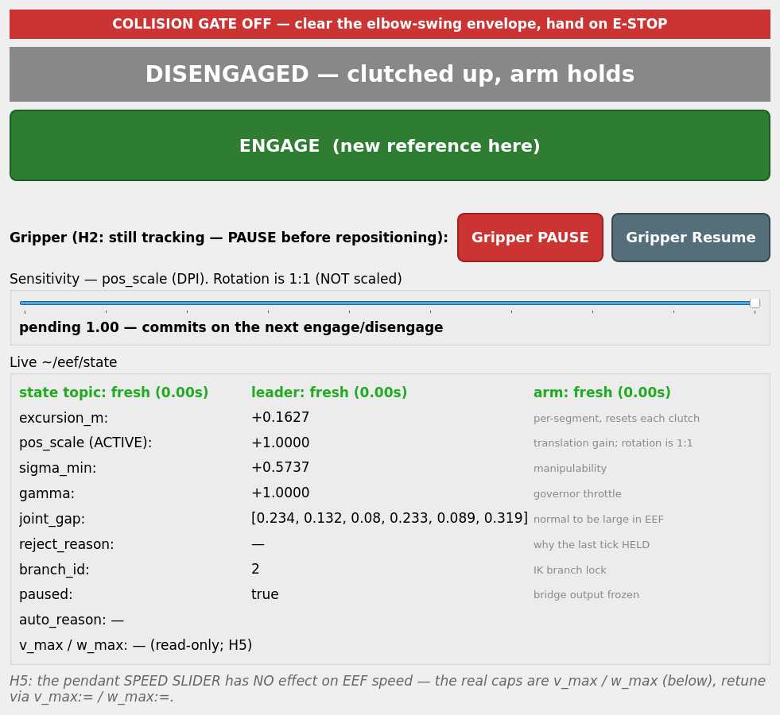
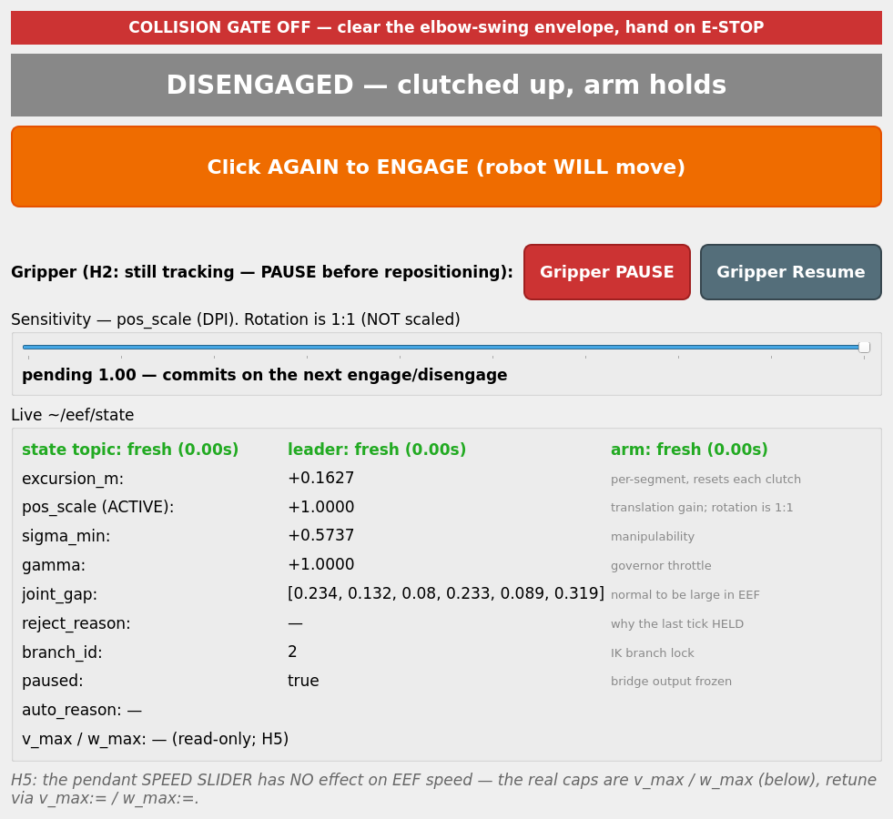
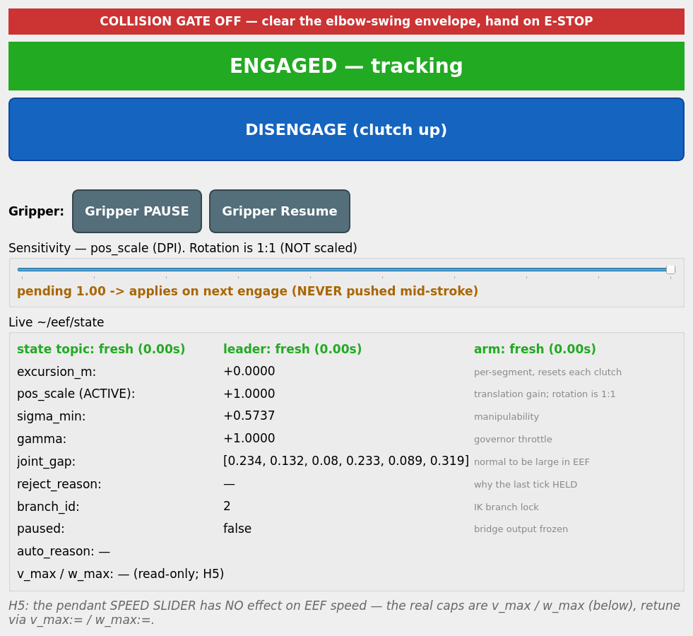

# GELLO → UR7e **EEF 모드** 실행 런북 (operator runbook)

> ### 🟢 2026-07-24 업데이트 — 실기 첫 투입 성공 + 아래가 바뀌었다
> EEF 3D-펜 텔레오퍼가 **실기 UR7e에서 동작 확인**되었다(사용자 확인). 이 세션에서 바뀐 것(전부 아직 **미커밋**):
> - **워치독**: `tick_budget` 초과가 성능 신호로 재분류됨 — 1틱 HOLD + leaky-bucket, 지속 ~1초만 disengage. "갈 수 있는데 갑자기 멈추던" 증상 해소 → **§4 하단 표**.
> - **`run_ur7e_gello_real.sh`**: `start_mode`를 더는 `gello`로 강제하지 않는다(비우면 `control_mode:=eef → switch_only` 자동 유도가 살아남). 배너가 실효값을 출력 → **§3.1**.
> - **`v_max`/`w_max` 기본값 2배**(0.16 / 1.0)로 상향, **`pos_scale`/`v_max`/`w_max` 라이브 튜닝** 가능(`ros2 param set`) → **§1.3**.
> - **EEF 마우스 GUI 신설**(`run_eef_gui.sh`) — 큰 토글 하나로 끄기/켜기, 감도 슬라이더, 그리퍼 → **§3.4.1**.
>
> **문서 상태 (2026-07-22 원본)**: 코드는 구현·mock 검증 완료(커밋 `2905925` + 이후 3D-펜 기동 경로 작업). 이 문서가 조작자용 **정본**이며, 설계·근거는 [`GELLO_UR7E_EEF_TELEOP_PLAN.md`](GELLO_UR7E_EEF_TELEOP_PLAN.md)를 본다. 두 문서가 어긋나면 **이 문서가 우선**이다(PLAN의 대체된 부분에는 `⛔ SUPERSEDED` 표시를 붙여 두었다).
>
> **안전 불변**: GELLO는 항상 passive read-only. Dynamixel에 절대 토크 X.
>
> ### 🔴 2026-07-22 정정 — 이전 판을 읽은 사람은 반드시 확인할 것
>
> 병행 조사에서 **이 문서의 사실오류 4건**이 확인되었다. 그중 첫 항목은 **실기 단계의 안전 판정 기준**이었다.
>
> | # | 이전 판의 서술 | 실제 |
> |---|---|---|
> | 1 | P6는 `pos_scale=0.0`이라 **"로봇 팔이 한 번도 움직이지 않아야 한다"** | **거짓.** `pos_scale`은 **위치 항만** 곱한다. 회전 채널은 그대로 살아 있어 **팔은 실제로 크게 움직인다**(실측 최대 관절 변화 1.02 rad). 고정되는 것은 **TCP 위치뿐** → **§3.2** |
> | 2 | `r_align_rpy`는 **리더 손목 ↔ UR 툴** 프레임 오프셋 | **거짓.** **베이스 ↔ 베이스** 회전이다. 그리고 현재 값 `[0,0,0]`은 **측정된 적이 없다** → **§1.6** (측정 절차 포함) |
> | 3 | P7 `rot_freeze:=true` / P8 `pos_freeze:=true`로 채널을 분리 | **두 플래그는 구현되어 있지 않다.** PLAN 산문에만 존재 → **§3.2 P7/P8 박스** |
> | 4 | engage 게이트 **G4가 `q_lead ≈ q_robot`을 강제**한다 | **거짓.** G4는 `_last_published` ↔ `_actual_pose`, **양쪽 다 로봇 쪽**이다. 리더-로봇을 비교하는 게이트는 **코드 어디에도 없다** → **§1.1 정정 박스** |

---

## 0. EEF 모드가 하는 일 (한 줄)

**상대(델타) EEF 텔레오퍼레이션 — "GELLO를 3D 펜으로 쓴다".** engage(클러치) 순간 GELLO EEF와 로봇 EEF를 각각 앵커로 스냅샷하고, 이후로는 **GELLO EEF의 앵커 대비 변화량만** 로봇 EEF 앵커에 적용한다. engage 순간 로봇은 움직이지 않는다(zero-jump). joint 모드(절대 미러링)와 공존하며 `control_mode` launch 파라미터로 고른다.

> **리더와 로봇은 관절 자세가 "일치하지 않아도 되는" 정도가 아니라, 영구히 다른 것이 정상이다.** 이것이 이 모드의 운용 전제다.
>
> - **수식은 이미 그렇게 되어 있다.** 델타 사상의 **자세 무관성이 증명**되어 있다 — `test/test_eef_pose_independence.py`의 22개 테스트(현재 전체 342개), 관절 불일치 **최대 5.62 rad**에서 최악 오차 **8.8e-13 m / 2.7e-13 rad**, 불일치 크기에 따른 **추세 없음**. 거부는 리더 불일치가 아니라 **로봇 쪽 `sigma_min`(조건수)** 을 따라간다.
> - **바꿔야 했던 것은 기동 경로뿐이었다** — 기동/복귀가 팔을 리더 관절 자세로 끌고 가지 않도록 (§3.5).
> - **`pos_scale = 1.0`은 손↔공구 1:1이 아니다.** 로봇이 손보다 더 크게 움직인다. 의도된 선택이다 (§1.2).
> - **`r_align_rpy`는 아직 측정된 적이 없다.** EEF 이동 "방향"의 정확성이 여기 걸려 있다 (§1.6).

---

## ⚠️ 시작 전 위험 고지 — 반드시 읽을 것

아래 항목들은 **코드가 막아주지 않는다.** 조작 절차와 물리적 배치로만 대응된다.

### (H1) 충돌 인지가 **전혀 없다**. keep-out 게이트는 현재 꺼져 있다

- `config/ur7e_gello_eef.yaml`의 `keepout_json`은 **`"{}"`** 다. 즉 engage 게이트 **G9와 런타임 keep-out 검사(L6)는 사실상 no-op**이며 항상 통과한다.
- 그 위에, EEF 모드는 **joint 모드보다 충돌 위험이 구조적으로 높다.** joint 모드에서는 조작자가 손 안의 축소 모델로 팔꿈치·어깨 위치를 운동감각으로 알지만, EEF 모드는 관절 형상 선택을 IK에 넘기므로 그 채널이 끊긴다. **TCP가 직선으로 10 cm 가는 동안 팔꿈치는 크게 스윙할 수 있고, 조작자에게는 예측 근거가 없다.** (PLAN §6.5 / Q7 — 이번 범위에서 **미해결로 남은** 항목)
- **유일한 완화**: 넉넉한 물리적 워크스페이스 클리어런스(특히 팔꿈치가 지나갈 공간), 낮은 `v_max`, 조작자 주시, **손을 E-STOP 위에 둘 것**.
- 워크셀 장애물(테이블 상판, 카메라 마운트 기둥 등)을 게이트로 막고 싶으면 `keepout_json`을 JSON 문자열로 채운다(yaml 주석에 예시). **채우면 `./build_ur7e.sh` 재실행 필요**(§2).

### (H2) 그리퍼는 disengage/재클러치 중에도 **GELLO 레버를 계속 따라간다**

- EEF 델타 로직은 arm 6축만 다루고 **그리퍼 경로는 한 글자도 건드리지 않는다.** `gello_publisher` → `gello_gripper_bridge` → Robotiq 체인은 EEF 상태와 무관하게 살아 있다. (PLAN §3.6 / Q9 — 자동 연동은 **미구현**)
- 따라서 **클러치를 뗀 상태에서 GELLO를 되잡을 때 손이 그리퍼 레버를 건드리면 로봇 그리퍼가 실제로 열리거나 닫힌다.** 물건을 쥐고 있는 중이면 놓칠 수 있고, 손가락이 끼일 수 있다.
- **조작 절차 (반드시)**:
  1. `8) EEF 디스인게이지` (또는 `9) 재클러치` 직전)
  2. **`11) 그리퍼 일시정지`** ← 되잡기 전에 사람이 직접 누른다. Robotiq은 현재 위치를 유지한다.
  3. GELLO를 편한 자세로 되잡는다.
  4. `7) engage` 또는 `9) reclutch`
  5. **`12) 그리퍼 재개`** (실제 위치에서 시드→램프)

### (H3) 손목 회전이 **재클러치를 넘어 누적된다** — 툴 케이블 감김 위험

- 회전 델타는 앵커 대비 상대량이고, **재클러치할 때마다 앵커가 새로 잡힌다.** 따라서 "한 번의 클러치 구간 안에서 몇 도 돌았나"는 제한되지만, **여러 번의 재클러치를 거친 `wrist_3`의 누적 회전량에는 상한이 없다.**
- 실제 위험은 **2F-85의 tool-comm 케이블**이다. 툴 통신선이 손목에 감기면 그리퍼가 응답을 멈추거나 선이 손상된다.
- **대응**: 세션 중 주기적으로 손목 케이블 상태를 눈으로 확인한다. 감기기 시작하면 `8) 디스인게이지` → `10) joint 모드 복귀`로 빠져나와 손목을 풀어준다.

### (H4) `max_excursion_m`은 **한 구간의 상한**이지 총 이동거리 상한이 아니다

- `max_excursion_m = 0.5`는 `‖p_cmd − p_r_anchor‖`를 본다(`eef_delta.py`의 `step()` 수용 스택). 그런데 **engage/재클러치마다 `p_r_anchor`가 새로 스냅샷**되어 예산이 **0으로 초기화**된다.
- 0.4 m씩 열 번 재클러치하면 TCP는 셀 어디로든 갈 수 있고 이 게이트는 **한 번도 걸리지 않는다.** "폭주 방지 백스톱"이지 워크스페이스 경계가 아니다.

### (H5) 펜던트 **속도 슬라이더가 EEF 경로에 먹지 않는다**

- PLAN §6.8은 `/speed_scaling_state_broadcaster`를 구독해 `v_max`·`w_max`에 곱하겠다고 적었으나, **구현되지 않았다.** 브리지 소스 전수 grep 결과 `speed_scaling` 문자열이 **한 곳도 없다.**
- 즉 펜던트에서 속도를 50%로 내려도 **우리가 내보내는 EEF 명령 속도는 그대로**다. 감속 수단은 **`v_max` / `w_max` 런치 인자뿐**이다.
- **속도를 줄이고 싶으면 슬라이더가 아니라 `v_max:=...`로 재기동한다.**

---

## 1. ⚙️ 실기 전에 설정해야 하는 값 — `config/ur7e_gello_eef.yaml`

이 파일은 `control_mode:=eef`일 때만 로드되므로 **joint 모드에는 전혀 영향이 없다.** tool 오프셋(§1.1)은 실측값이 들어가 있고, 나머지 임계값(`sigma_*`, `branch_tol`, `lag_max_pose` …)은 아직 **미검증 초기값**이다.

### 1.1 tool 오프셋 (`tool_l_xyz_rpy`, `tool_r_xyz_rpy`)

`[x, y, z, roll, pitch, yaw]` (**미터**, rad). **flange(tool0) 기준** 오프셋으로, 각 쪽 EEF의 **회전 중심**을 정의한다. `_l`/`_r`은 IK 좌/우 분기가 아니라 **리더(GELLO) / 로봇(UR7e)** 쪽이다.

```
T_g = fk(q_lead_f) @ T_tool_L     # 리더 쪽   (`step()`)
T_r = fk(q_r)      @ T_tool_R     # 로봇 쪽   (`_set_anchor()`)
```

#### 현재 설정값 (2026-07-22, yaml에 반영 완료)

| 키 | 값 | 근거 |
|---|---|---|
| `tool_r_xyz_rpy` | `[0.0, 0.0, 0.174, 0.0, 0.0, 0.0]` | **실측.** Robotiq 2F-85 끝점이 flange에서 **+Z 174 mm**. 펜던트 TCP `TCP_2f85`도 같은 값으로 설정됨 |
| `tool_l_xyz_rpy` | `[0.0, 0.0, 0.174, 0.0, 0.0, 0.0]` | `tool_r`과 **의도적으로 동일**. 이유는 아래 "왜 tool_l = tool_r 인가" |

> ### ❗ 펜던트의 TCP 설정은 이 코드로 **전파되지 않는다**
>
> EEF 경로는 UR 드라이버/펜던트의 TCP를 **읽지 않는다.** 자체 FK(`ur_kin.fk`)로 **flange(tool0)까지만** 풀고, 그 뒤에 위 YAML 값을 직접 곱한다(`EefDeltaController.__init__`에서 파라미터→행렬 변환, 노드 쪽은 `gello_ur_bridge_node.py`의 eef 파라미터 선언 + eef 셋업 블록). 브리지는 `/tcp_pose_broadcaster/pose`도 드라이버 TCP도 구독하지 않는다(코드 전수 확인 완료).
>
> **펜던트에서 TCP를 다시 잡으면 이 YAML도 손으로 고치고 재빌드해야 한다.** 두 곳이 어긋나면 아무 경고 없이 서로 다른 회전 중심을 쓰게 되고, 증상은 "순수 회전 입력에 기생 병진"으로만 나타난다.

#### `tool_l`이 가리키는 프레임 — **가장 헷갈리는 지점**

**`tool_l`은 물리적 GELLO의 flange 기준 오프셋이 아니다.** 이 코드에 GELLO의 링크 길이·DH·URDF는 **어디에도 존재하지 않는다.** 리더 EEF는 GELLO 관절각을 **로봇과 똑같은 UR7e FK**(`ur_kin.fk`)에 그대로 넣어 만든다. 즉 여기서 말하는 "리더"는 **GELLO 자세를 미러링하는 가상의 풀사이즈 UR7e**이고, `tool_l`은 그 **가상 UR7e의 flange 기준** 오프셋이다.

#### 왜 `tool_l = tool_r` 인가 (현재 선택, 근거 있음)

`tool_l = tool_r = [0, 0, 0.174, 0, 0, 0]`은 **"가상 리더 로봇도 실제 로봇과 똑같은 그리퍼를 달고 있다"** 는 뜻이다. 리더 쪽 손목 회전이 **자기 툴 위의 같은 점**을 중심으로 돌게 되어, 로봇 TCP의 회전 중심과 대응이 맞는다.

> #### ⚠️ 정정 (2026-07-22) — "engage 시 `q_lead ≈ q_robot`이라 델타가 항등으로 환원된다"는 근거는 **폐기**
>
> 이 문서의 이전 판은 위 선택의 근거로 *"engage 시점에 `q_lead ≈ q_robot`이 보장된다(BOOTSTRAP이 joint 패스스루이고 게이트 G4가 `anchor_agree_tol = 0.02 rad` 이내를 강제한다)"* 라고 적었다. **두 근거가 모두 틀렸다:**
>
> 1. **G4는 리더와 로봇을 비교하지 않는다.** `_last_published`(우리가 마지막으로 보낸 명령)와 `_actual_pose`(로봇 실측)를 비교한다 — **양쪽 다 로봇 쪽**이다(`gello_ur_bridge_node.py`의 `_run_eef_gates()`). G4가 증명하는 것은 "명령 체인이 실제 팔에서 벗어나지 않았다 = 앵커를 믿을 수 있다"뿐이다. **리더 관절과 로봇 관절을 비교하는 게이트는 코드 어디에도 없다.**
> 2. `q_lead ≈ q_robot`은 오직 **BOOTSTRAP이 joint 패스스루라서** 부수적으로 성립하던 성질이었다. **"GELLO = 3D 펜"** 운용에서는 두 팔의 관절 자세가 **영구히 다른 것이 정상**이므로, 이 성질은 앞으로 성립하지 않는다(§3.5).
>
> **그래도 문제없다.** 델타 수식은 **자세 무관(pose-independent)임이 증명**되어 있다 — `test/test_eef_pose_independence.py`의 **22개 테스트**(현재 전체 스위트 **342개**)에서 관절 불일치 **최대 5.62 rad**까지 밀어붙여도 최악 오차 **8.8e-13 m / 2.7e-13 rad**이고, 오차가 불일치 크기에 따라 커지는 **경향 자체가 없다**. 거부(reject)는 리더 불일치가 아니라 **로봇 쪽 자세의 조건수(`sigma_min`)** 를 따라간다.
>
> 즉 **3D 펜 요구사항은 수식 차원에서 이미 충족되어 있었고**, 실제로 손봐야 했던 것은 기동(bring-up) 경로뿐이다(§3.5).
>
> `tool_l = tool_r`은 **기본값으로 유지**한다. 다만 그 근거는 이제 "joint 모드로 환원되니까"가 아니라 위 문단의 회전중심 대응이며, **실증은 P8의 기생 병진 < 1 cm**로 한다.

수식적으로도 깔끔하다:

- `T_tool_L`의 **회전 성분은 델타에서 항등적으로 상쇄된다** — 델타가 `R_g @ R_g_anchor.T` 형태라 `R_toolL @ R_toolL.T = I`가 되기 때문이다(`eef_delta.py`의 `step()`). 즉 `tool_l`의 rpy 세 칸은 **아무 효과가 없다.**
- 효과가 있는 것은 **병진 성분뿐**이고, 그마저도 **리더가 회전하는 동안에만** 나타난다(순수 병진에서는 `p_g − p_g_anchor`가 tool 오프셋과 무관하다).

#### ⚠️ 함정 — `tool_l = 0`, `tool_r = 0.174`로 두고 싶어지는 유혹

"GELLO에는 Robotiq 그리퍼가 안 달려 있으니 리더는 0이 맞지 않나?"는 **틀렸다.** 그렇게 두면 리더 델타는 **가상 flange의 변위**인데 그것을 **로봇의 TCP**에 적용하게 된다. 두 값은 **리더가 회전하는 순간부터 달라지므로**, 팔이 익숙한 joint 모드 거동에서 벗어나기 시작하는 시점이 하필 **P8(순수 회전) — 가장 디버깅하기 어려운 단계**가 된다. 하지 말 것.

#### 이전 판(“사람이 GELLO를 잡는 그립점”) 서술은 **오류였다 — 정정**

이 문서의 예전 판은 `tool_l`을 "사람이 GELLO를 어디를 잡는가(그립점)"로 설명했다. **프레임이 맞지 않는다:**

- 사람의 그립점은 **물리적(=작은) GELLO 위의 거리**인데, 이 파라미터는 **가상 풀사이즈 UR7e flange 기준**으로 해석된다.
- 그 값을 여기 넣으려면 먼저 GELLO 축소비 `k`로 나눠 가상-UR 공간으로 환산해야 한다. 그런데 **`k` 실측은 의도적으로 생략하기로 결정된 항목**이다(§1.2, PLAN P-1 5번 SUPERSEDED).

즉 그립점 해석은 "그냥 다른 값을 적어 넣으면 되는 대안 규약"이 **아니라**, 하지 않기로 한 측정을 전제로 하는 방식이다. **채택하지 않는다.**

#### P6 / P7에는 (거의) 무관하다

tool 오프셋은 **회전 중심에만** 영향을 준다. **P6(TCP 위치 고정)과 P7(병진 위주)은 이 값이 무엇이든 그대로 진행 가능**하다. 실제로 문제가 되는 것은 **P8(회전 위주)** 부터이고, P8 완료 기준이 곧 이 값의 검증이다 — **기생 병진 `‖p_cmd − p_r_anchor‖ < 1 cm`**(`~/eef/state`의 `excursion_m`).

> 단, **P7에서 회전이 완전히 배제되지는 않는다** — `rot_freeze`가 구현되어 있지 않기 때문이다(§3.2 P7/P8 박스). 조작자가 리더 자세를 유지해 회전 입력을 **작게** 만드는 것으로만 분리한다.

### 1.2 `pos_scale` — **`1.0` 그대로 두면 됨 (측정 불필요, 결정 완료)**

리더 EEF는 GELLO 관절각을 **풀사이즈 UR7e FK**에 넣어 계산하므로(`T_g = fk(q_lead_f) @ T_tool_L`, `eef_delta.py`의 `step()`), 위치 델타 `Δp_g`는 이미 풀사이즈 UR7e 공간의 변위다. 따라서 `pos_scale=1.0`이면 **로봇 EEF 이동량 = joint 모드의 EEF 이동량**과 일치한다 — "작은 GELLO 조금 → 큰 로봇 많이"는 joint 모드에서 이미 익숙한 정상·의도된 동작이다. 축소비 `k`를 따로 측정할 필요 없다. (`1.0` 이외 값은 "의도적 증폭/감쇠"로 취급.)

> #### 이 선택의 정직한 트레이드오프 — **"손이 가는 곳에 공구가 간다"가 아니다**
>
> **사용자가 3D 펜 프레이밍 하에서 `pos_scale = 1.0`을 재확인했다. 이 항목은 다시 열지 않는다.** 다만 무엇을 고른 것인지는 명확히 기록해 둔다:
>
> - `1.0`이 1:1인 것은 **가상 풀사이즈 UR7e 공간**에서다. **조작자의 손 공간에서는 1:1이 아니다.**
> - 손의 물리 변위는 로봇 TCP 변위보다 **대략 `k`배 작다**(`k` = GELLO 축소비). **`k`는 측정하지 않기로 한 값**이다(PLAN Q1 / P-1 5번).
> - 즉 이것은 **의도적으로 증폭된 펜**이다. "펜"이라는 말에서 자연스럽게 기대하는 **"내 손이 가는 그 자리에 공구 끝이 간다"는 이 설정이 제공하는 것이 아니다.**
> - 그 대신 얻는 것: **joint 모드와 완전히 동일한 조작 감각**. 매일 쓰는 기준선을 그대로 유지하는 쪽을 택했다.
> - 따라서 "손 5 cm에 TCP가 그보다 크게 간다"는 **정상**이다. 이것을 버그로 보고할 필요 없다.
>
> `1:1 손↔공구` 감각이 정말 필요해지면 그때는 `k`를 측정해 `pos_scale = k`로 낮추는 별도 작업이 된다(그러면 joint 모드보다 둔해진다).

> #### `pos_scale`은 **위치 항만** 곱한다 (회전 채널은 스케일 없음)
>
> `p_des = p_r_anchor + pos_scale * R_align @ (p_g − p_g_anchor)` (`eef_delta.py`의 `step()`)에만 들어간다. `R_des = R_delta @ R_r_anchor`(`step()`의 회전 항)에는 **`pos_scale`이 없다.** `pos_scale = 0.0`으로 두어도 **회전은 그대로 살아 있고 팔은 움직인다** — 자세한 실측치와 안전 함의는 **§3.2 P6 정정 박스**를 반드시 읽을 것.

> **PLAN §3.1 "성질 2", P7, §9.2 증상표는 이와 반대로 "`k`를 실측해 `pos_scale`에 넣어라"고 적혀 있었다. 그 서술은 폐기(SUPERSEDED)되었고 PLAN 본문에 그렇게 표시해 두었다. 이 절이 정본이다.**
>
> `pos_scale`을 `0.0`으로 두는 유일한 경우는 브링업 **P6 단계**뿐이다(**TCP 위치**가 앵커에 고정되어야 하는 단계 — 팔 전체가 정지하는 단계가 **아니다**, §3.2). P6가 끝나면 `pos_scale` 인자를 **빼서** yaml 기본값 `1.0`으로 돌아온다.

### 1.3 속도/보간은 우리 파이프라인이 처리 (UR 드라이버에 의존 X)

`forward_position_controller`는 **자체 속도 제한을 하지 않고**, 명령이 너무 빠르면 protective stop을 낸다. 그래서 rate limiting은 우리 쪽에서 한다 — 리더 전용 one-euro(`_euro_lead`) + SE(3) 카테시안 속도 거버너(`v_max`/`w_max`) + joint slew clamp. **손을 아무리 빨리 휘둘러도 로봇 EEF 속도는 `v_max`로 캡**된다.

#### `v_max` / `w_max` — 팔로우 응답 속도 (2026-07-24: 기본값 2배 + 라이브 튜닝)

| 파라미터 | 기본값 | 뜻 |
|---|---|---|
| `v_max` | **0.16 m/s** (구 0.08) | 로봇 EEF **직선 속도 상한** |
| `w_max` | **1.0 rad/s** (구 0.5) | 로봇 EEF **회전 속도 상한** |

"따라오는 게 느리다"의 1순위 조절값이다. `pos_scale`(감도, 거리)과 달리 이건 **속도**다 — GELLO를 빨리 움직이면 로봇이 `v_max` 상한에 걸려 뒤처졌다 따라잡는데, `v_max`를 올리면 그 랙이 준다. 2026-07-24 사용자 요청으로 플랜의 보수적 `0.08/0.5`에서 **2배**로 올렸다.

**`v_max` / `w_max` / `pos_scale`은 이제 실행 중에 라이브로 바꿀 수 있다** (2026-07-24: `_on_set_parameters`에 라이브 세터 추가, `self._eef is not None` 가드로 joint 모드 무영향):

```bash
source <repo>/ros2_ur_ws/install/setup.bash
ros2 param set /gello_ur_bridge v_max 0.24     # 더 빠르게
ros2 param set /gello_ur_bridge w_max 1.4
ros2 param set /gello_ur_bridge pos_scale 0.5  # 더 정밀하게 (감도 ↓)
```

> ⚠️ 빠를수록 위험 — 충돌 인지 없음(H1), E-STOP 손 닿는 곳에. 그리고 `v_max`를 아주 높이면 **관절 슬루 상한 `max_step_rad`**(base params, 0.0025 rad/tick @250Hz = 0.625 rad/s/joint, joint 모드와 공유)가 binding limit이 되어 **STEP_FLOOR HOLD가 늘어난다**. 그 이상 빠르게 하려면 `publish_rate_hz`를 500으로 먼저 올려야 한다. 특이점 근처에선 어차피 자동 감속(gamma)한다 — 정상.

> **라이브로 바꾼 값은 런치를 다시 띄우면 사라진다.** 영구 반영은 `config/ur7e_gello_eef.yaml`의 `v_max`/`w_max`/`pos_scale`을 고치고 `colcon build`. `pos_scale`을 ENGAGED 중에 바꾸면 진행 중 스트로크가 미끄러질 수 있으니(§1.2), GUI는 **disengage/engage 순간에만** 커밋한다(A안).

### 1.4 keep-out — 현재 **비활성**

`keepout_json`은 현재 `"{}"`(미설정, G9 항상 통과). **이것이 무엇을 의미하는지는 위 (H1)을 반드시 읽을 것.** 워크셀 장애물 게이트가 필요하면 JSON 문자열로 채운다(예시는 yaml 주석 참고). Q6 결정: 당분간 펜던트에서 처리 → 비워둠.

### 1.5 `ik_backend`

`"analytic"` (ur_kin에 벤더링된 순수 numpy 폐형해, 8해 enumerate → branch-lock에 필요). `"numeric"`은 단순 폴백.

### 1.6 `r_align_rpy` — **베이스↔베이스 회전. 지금 값은 측정된 적이 없다**

#### 무엇인가 (프레임 정정, 2026-07-22)

`ur7e_gello_eef.yaml`의 이전 주석은 이것을 *"GELLO 리더의 **손목 프레임**과 UR **툴 프레임** 사이의 오프셋"* 이라고 설명했다. **틀렸다.** 이것은 **베이스 대 베이스** 회전이다:

```
R_align = R_{UR base_link  ←  가상 리더 base_link}
```

즉 **"GELLO 베이스가 UR base_link에 대해 얼마나 돌아앉아 있는가"** 다. 손목·툴과는 아무 관계가 없다(툴 쪽은 §1.1의 `tool_l`/`tool_r`이 담당한다). PLAN §3.3은 처음부터 이렇게 맞게 적혀 있었다.

수식에서의 위치(`eef_delta.py`의 `step()`):

```
R_delta = R_align @ (R_g @ R_g_anchor.T) @ R_align.T
p_des   = p_r_anchor + pos_scale * R_align @ (p_g − p_g_anchor)
```

수치 확인 결과: `r_align_rpy`를 바꾸면 로봇 TCP 변위의 **방향이 회전하고, 크기는 그대로 보존**된다. 이 성질은 **로봇 자세와 무관**하다.

#### 왜 지금 값이 위험한가

`r_align_rpy = [0, 0, 0]`은 **"GELLO 베이스 프레임 = UR base_link 프레임"이라고 단언**하는 값이다. **아무도 이것을 측정한 적이 없다.** 게다가 `scripts/gello_get_offset.py`는 관절 오프셋을 **π/2의 배수로 스냅**하므로(`np.linspace(-8π, 8π, 33)` → π/2 간격), 베이스 관절에 **0/90/180/270° 4중 모호성**이 그대로 구워져 들어간다. 3D 펜 프레이밍에서 이것은 **잠재 버그**이고, **틀렸을 가능성이 높다.**

> **이전 프레이밍에서는 `[0,0,0]`이 유일하게 옳은 값이었다.** "EEF 모드는 joint 모드를 재현해야 한다"는 옛 전제 하에서는 양쪽 관절이 같으므로 베이스도 같다는 결론이 자동으로 따라왔다. **3D 펜 프레이밍은 그 논거를 폐기한다.** 이제 `R_align`은 **측정해야 하는 값**이다.

#### 증상이 고약하다 — **크기는 항상 맞고, 방향만 틀린다**

| 오차 | 10 cm 이동 시 **가로 방향 오차** | 조작자가 느끼는 것 |
|---|---|---|
| 2° | 0.35 cm | 못 느낌 |
| 5° | 0.87 cm | 못 느낌 / 무시 가능 |
| 10° | 1.74 cm | "팔이 좀 비딱하게 간다" |
| 20° | 3.42 cm | "게가 걷는 것 같다" — **그런데 대개 그냥 넘어간다** |
| 45° | 7.07 cm | 명백히 이상 |
| 90° | — | **의도한 방향으로 이동량 0** (착각할 여지 없음) |

가장 위험한 구간은 **10~20°** 다. "오늘따라 팔이 좀 비딱하네"로 합리화되고, 그 상태로 데이터를 계속 모으게 된다. **90° 오차는 오히려 안전하다 — 즉시 티가 나기 때문이다.**

**요구 정밀도: ≤ 5° 면 충분하다.** 그 이상 정밀도를 좇을 필요 없다.

#### 측정 절차 — **로봇을 움직이지 않고, 초보자도 할 수 있다**

핵심 항등식: **두 팔이 같은 관절 벡터에 있을 때**(joint 모드가 이미 그렇게 만들어 준다),

```
ψ = (GELLO 쪽 세계 방위각) − (UR 쪽 세계 방위각)
```

이고, **자세에 의존하는 항은 정확히 상쇄된다.** 그래서 **어떤 자세를 고르든 결과가 같다** — 자세 선택을 고민할 필요가 없다.

**(0) 순수 yaw인지 먼저 확인.** 수평계(스마트폰 수평계 앱도 됨)를 UR 베이스 상면과 GELLO 베이스 상면에 각각 올린다. 둘 다 수평이면 두 베이스의 차이는 **yaw 하나뿐**이고, `r_align_rpy = [0, 0, ψ]` 형태가 된다. 어느 한쪽이 기울어 있으면 roll/pitch도 필요하므로 여기서 멈추고 에스컬레이션한다.

**(1) 같은 관절 자세로 만든다.**
```bash
cd <repo>/ros2_ur_ws && source install/setup.bash
HEADLESS=true ./run_ur7e_gello_real.sh          # joint 모드 (기본)
```
핸드셰이크를 끝까지 완료한다. 그 다음 **팔이 접히지 않은, 쭉 뻗은 자세**로 GELLO를 천천히 옮긴다(방위각을 눈으로 읽기 쉬워진다). 그 자리에서 조작자 콘솔의 **`2) 정지/일시정지`**(→ `/gello_ur_bridge/pause`)로 멈춘다. 이 시점에 `q_lead ≈ q_robot`이다.

**(2) 방위각 두 개를 재고 뺀다 (본 측정).**
- **각 팔마다**: ① **shoulder 축**(베이스 회전축)에서 바닥으로 다림줄을 내려 바닥에 점을 찍는다. ② **wrist_3 중심**에서 바닥으로 다림줄을 내려 두 번째 점을 찍는다.
- 두 점 사이에 **실을 팽팽하게 놓는다.** 이 실이 그 팔의 **세계 방위각**이다.
- UR 쪽 실과 GELLO 쪽 실 **사이의 각도**를 각도기 또는 휴대폰 나침반으로 잰다. → 이것이 **ψ**.
- **부호 규약: 위에서 내려다봤을 때 반시계 방향이 +.** (UR 실 → GELLO 실 방향으로 반시계면 +)
- yaml에 `r_align_rpy: [0.0, 0.0, ψ]`(**rad**)로 넣는다. 도 → rad 환산을 잊지 말 것.

**(3) 오프라인 검증 (로봇 정지 상태로 가능).**
```bash
ros2 bag record /gello/joint_states     # 또는 topic echo 저장
```
GELLO 핸들을 **세계 기준으로 알고 있는 3방향**(예: 테이블 모서리를 따라 앞/오른쪽/위)으로 각각 밀면서 기록한다. 오프라인에서 `fk(q) @ T_tool_L`의 변위를 계산하고, 그것을 `Rz(ψ)`로 회전시킨 결과가 **의도한 세계 방향과 일치**하는지 본다. 어긋나면 부호 또는 90° 배수를 잘못 잡은 것이다.

**(4) ≤ 2° 정밀도가 필요하면** — (3)의 (리더 변위, 세계 방향) 쌍을 **N ≥ 4개** 모아 **Kabsch / orthogonal Procrustes**로 푼다. 4 mm 수준의 측정 노이즈를 넣은 검증에서 **참값 37°에 대해 36.21°** 를 복원했다. 다만 앞서 말했듯 **≤ 5°면 충분하므로 보통 여기까지 갈 필요는 없다.**

#### 반영 방법

`r_align_rpy`는 **launch 인자가 아니다**(`v_max`/`w_max`/`pos_scale`만 인자다). **yaml을 고치고 `./build_ur7e.sh`로 재빌드**해야 값이 반영된다(§2).

---

## 2. 빌드 & 배포

```bash
cd <repo>/ros2_ur_ws
./build_ur7e.sh            # rosdep + colcon build --packages-select ur_gello_bringup
source install/setup.bash
```

- 이 PC/실기 PC는 **ROS 2 Humble / Python 3.10**이다(`/opt/ros/humble`; `build_ur7e.sh`와 `run_ur7e_gello_real.sh`가 그걸 소스한다). PLAN 문서의 "Jazzy/24.04/py3.12" 서술은 **설계 당시의 개발 PC** 기준이므로 그대로 믿지 말 것.
- **`build_ur7e.sh`가 이 환경에서 실패하면**(`AMENT_TRACE_SETUP_FILES: unbound variable` — `set -euo pipefail` + `/opt/ros/humble/setup.bash` 상호작용) colcon을 직접 부른다: `source /opt/ros/humble/setup.bash && colcon build --packages-select ur_gello_bringup`. (소스 트리에 `act_venv/`가 있으면 colcon이 numpy 테스트 디렉터리에서 `package identification` ERROR를 찍는데, `Finished <<< ur_gello_bringup`가 뜨면 무시해도 된다.)

**실행 스크립트 (모두 `ros2_ur_ws/`):**

| 스크립트 | 하는 일 |
|---|---|
| `run_ur7e_gello_real.sh` | 실기 teleop 런치. `control_mode:=eef`로 EEF 모드. `HEADLESS=true`로 Remote(§3.1) |
| **`run_eef_gui.sh`** | **EEF 마우스 GUI**(§3.4.1) — 별도 터미널. `= ros2 run ur_gello_bringup gello_eef_gui` |
| `run_operator_console.sh` | 텍스트 콘솔(§3.4.2) — GUI 대안 / joint 핸드셰이크용 |

(GUI는 `setup.py`의 `gello_eef_gui` 엔트리로 설치되고 `python3-pyqt5`에 의존 — `package.xml`에 선언됨. 재빌드 후 `source install/setup.bash` 필요.)

> ⚠️ **config yaml을 수정하면 반드시 다시 빌드하라.** colcon은 config를 install로 **복사**한다(symlink 아님). 재빌드 안 하면 launch가 옛 값을 읽는다(`--symlink-install`도 ament_python `data_files`는 복사한다). `tool_*_xyz_rpy`, `keepout_json`, `r_align_rpy`, `ik_backend`, `sigma_*` 등이 전부 여기 해당한다.
>
> **예외 — `v_max` / `w_max` / `pos_scale` 세 개는 launch 인자로 넘길 수 있어 재빌드가 필요 없다.** §3.3 참고.

---

## 3. 단계적 브링업 (mock → 실기)

첫 실기 실행은 "연결하고 engage"가 아니라 **저게인 게이트드 브링업**이다. `pos_scale` 때문이 아니라 특이점 거동·IK·**충돌 비인지**(위 H1)가 실기 첫 확인이라서.

### 3.1 실기 기동 — **Remote(headless) 모드**

우리 운용은 펜던트 Play가 아니라 **Remote/headless(Method B)** 다.

```bash
cd <repo>/ros2_ur_ws
source install/setup.bash

# joint 모드 (기본, 오늘과 동일)
HEADLESS=true ./run_ur7e_gello_real.sh

# eef 모드
HEADLESS=true ./run_ur7e_gello_real.sh control_mode:=eef
```

`run_ur7e_gello_real.sh`는 `robot_ip`(기본 `192.168.10.11`) / `headless_mode`를 스스로 붙이고, **커맨드라인 끝에 붙인 인자를 `ros2 launch`로 그대로 전달**한다(스크립트 말미 `exec ros2 launch ... "${ARGS[@]}" "$@"`). `HEADLESS=true`가 `headless_mode:=true`로 번역된다. ros2 launch는 중복 인자에서 뒤가 이기므로 필요하면 `robot_ip:=` 등도 뒤에 덧붙여 덮어쓸 수 있다.

#### 그리퍼 DISCRETE 모드 — 같은 명령줄에 붙인다 (opt-in, 기본 꺼짐)

```bash
HEADLESS=true ./run_ur7e_gello_real.sh control_mode:=eef gripper_mode:=discrete
```

`gripper_mode`(`continuous`|`discrete`, 기본 `continuous`)는 **그리퍼 브릿지 전용 인자**라 EEF 델타 경로에는 아무 영향이 없다 — H2("그리퍼는 EEF 상태와 무관하게 GELLO를 따라간다")도 그대로다. 고치는 것은 하나다: 방아쇠 스프링이 덜 돌아와 **그리퍼가 "끝까지 안 열리는"** 증상. 켜면 EEF GUI에 이산 상태(`DISABLED`/`UNKNOWN`/`OPEN`/`CLOSED`) 표시등이 뜬다.

**임계값·히스테리시스·`UNKNOWN`이 왜 있는지·녹화에 미치는 영향은 [`GELLO_UR7E_GRIPPER.md` §8](./GELLO_UR7E_GRIPPER.md#8-그리퍼-discrete-모드-gello-텔레오퍼-전용-opt-in)에 있다.** 여기서 반복하지 않는다.

> **`start_mode`는 스크립트가 붙이지 않는다 (2026-07-24 수정).** 예전 스크립트는 `start_mode:=gello`를 **항상** 붙였고, 그러면 §3.5의 `control_mode:=eef → switch_only` 자동 유도가 **명시 인자에 덮여서 무력화**된다 — 즉 `control_mode:=eef`를 줘도 팔이 기동하자마자 리더 관절 자세로 스윙한다(정확히 3D 펜 모드가 없애려던 그 동작). 지금은 환경변수 `START_MODE`가 **비어 있을 때 인자를 아예 붙이지 않아서** 런치의 자동 유도가 살아 있다. 배너가 `control_mode=... | start_mode=...`로 **실효값**을 출력하므로 기동 시 그 줄을 확인할 것. `START_MODE=gello ./run_ur7e_gello_real.sh ...`로 옛 동작을 강제할 수는 있고, 그때는 배너가 경고를 찍는다.

**Remote 모드에서 적용되지 않는 펜던트 절차:**

| 절차 | Remote(headless)에서 |
|---|---|
| External Control 프로그램 Load | ❌ 불필요 — 드라이버가 URScript를 직접 스트리밍한다 |
| 펜던트에서 **Play** 누르기 | ❌ 불필요. Play/Load 버튼이 회색인 것이 **정상** |
| `ur_load` / `ur_play` / `ur_stop` 호출 | ❌ **금지** — 아래 참고 |
| "External Control이 Playing인지 확인" 안내 문구 | ❌ 무시. 스크립트도 HEADLESS일 때는 이 문구 대신 REMOTE 확인 문구를 출력한다(124~128행) |

**Remote 모드에서도 그대로 필요한 것:**

- 일회성 펜던트 설정: `Settings > System > Remote Control > Enable` → 우상단 Local/**Remote** 토글. **Remote→Local 복귀는 펜던트에서만 가능**(안전 설계).
- 펜던트 우하단이 **Real Robot**(Simulation 아님).
- **로봇 전원 ON** — 그리퍼 tool voltage(24 V)를 드라이버가 공급하므로 전원이 꺼져 있으면 2F-85가 응답하지 않는다.
- **물리 E-STOP은 모드와 무관하게 동일하게 작동한다.** 최종 백스톱이며, EEF 모드에서도 손이 닿는 곳에 둔다.

**드롭/보호정지 복구 (`remote_helpers.sh`)**

```bash
source <repo>/ros2_ur_ws/remote_helpers.sh
ur_resend    # reverse-interface 드롭 복구 (Method B 전용, /io_and_status_controller/resend_robot_program)
ur_unlock    # protective stop 해제 — ⚠️ 원인을 먼저 제거한 뒤에
ur_mode      # 로봇 모드 확인 (POWER_OFF / IDLE / RUNNING)
```

> ⛔ **`ur_play` / `ur_load` / `ur_stop`은 Method A(펜던트 External Control) 전용이다. headless 세션에서 섞어 쓰지 말 것** — URScript를 주입하는 두 경로가 서로 싸운다(`remote_helpers.sh` 30~31행의 명시적 경고). headless 드롭 복구는 **`ur_resend` 하나**다.

> **EEF 세션 복구 원칙**: External Control/`/joint_states`가 끊기면 브리지는 fail-closed로 DISENGAGED되고(=`_paused`) **앵커를 폐기**한다. 링크가 살아났다고 해서 바로 `7) engage`하면 안 된다 — 브리지가 PAUSED이므로 거부된다. **복귀는 `13) EEF 재무장`(`~/eef_resume`) → 상태가 `HOLD`가 된 것을 확인 → `7) engage`** 순서다(§3.5). **`1) 진행/재개`(`~/resume`)로 복귀하지 말 것** — 그 경로는 팔을 joint 패스스루로 떨어뜨려 리더 관절 자세로 슬루시킨다.

### 3.2 단계 표

| 단계 | 환경 | 명령 / 파라미터 | 확인 |
|---|---|---|---|
| P4 | mock + RViz | `ros2 launch ur_gello_bringup ur7e_gello_eef_mock.launch.py pattern:=offset_hold` | 핸드셰이크 후 `~/eef_engage` → RViz에서 **로봇 미동(zero-jump)** 눈으로 |
| P5 | mock | 동일 | 거부 사유들, γ 락업 탈출, 재클러치, disengage 즉시정지 |
| **P6** | **실기** | `HEADLESS=true ./run_ur7e_gello_real.sh control_mode:=eef pos_scale:=0.0 v_max:=0.01 w_max:=0.05` | **TCP 위치** 무동작 (팔은 움직인다 — 아래 정정 박스). 기준 (a)~(e) 전부 |
| P7 | 실기 | `... control_mode:=eef v_max:=0.02` → `v_max:=0.05` (`pos_scale`은 **빼서** 1.0) | 병진 위주. 손 축이동 → TCP 동축·동부호 이동, 축간 크로스토크 없음. **`R_align` 검증 단계** |
| P8 | 실기 | `... control_mode:=eef v_max:=0.05` | 회전 위주. **§1.1 tool 오프셋의 검증 단계** — 기생 병진 < 1 cm |
| P9 | 실기 | `... control_mode:=eef` (yaml 기본 `v_max=0.08`) | 6-DoF + 재클러치 워크플로 |

> ### ⛔ P7 / P8은 **채널 분리가 불가능하다** — PLAN의 `rot_freeze` / `pos_freeze`는 **존재하지 않는다**
>
> PLAN §8 P7은 `rot_freeze:=true`, P8은 `pos_freeze:=true`를 전제로 쓰여 있다. **이 두 플래그는 리포 어디에도 구현되어 있지 않다** — 소스·launch·yaml 전수 grep 결과 **PLAN §8의 P7/P8 산문 두 줄에만** 등장한다. launch 인자도, 노드 파라미터도, `eef_delta.py`의 cfg 키도 아니다. **넘겨도 원하는 효과는 절대 나지 않는다.**
>
> **따라서 실제로 실행 가능한 P7/P8은 다음과 같다:**
>
> - **P7 (병진 위주)**: 6채널이 전부 살아 있는 상태에서, 조작자가 **리더의 자세(회전)를 최대한 유지한 채 평행이동만** 준다. 회전이 조금 섞이는 것은 불가피하므로, 판정은 "TCP가 손과 **같은 축·같은 부호**로 가는가"로 하고, 기생 회전은 무시한다. **P7 결과에는 P8의 회전 거동이 이미 섞여 들어온다** — "회전 버그를 P7에서 완전히 배제한다"는 PLAN의 문장은 이 구현에서는 **성립하지 않는다.**
> - **P8 (회전 위주)**: 리더 그립점을 **한 자리에 고정**한 채 손목만 비튼다. 판정은 기생 병진 `‖p_cmd − p_r_anchor‖ < 1 cm`(`~/eef/state`의 `excursion_m`)이다. 손 자체가 이동하면 그 병진은 정상 명령이므로 판정이 오염된다 — **손을 고정하는 것이 이 단계의 핵심 절차**다.
>
> 단계를 나누는 의미는 여전히 있다(증상 분리, 저속 상승). 다만 **"코드가 채널을 잠가준다"는 기대는 버릴 것.** 두 플래그를 진짜로 원하면 별도 구현 작업이며 이번 범위 밖이다.

#### 🛑 P6에서 `pos_scale=0.0`이 하는 일 — **"무동작"이 아니다** (2026-07-22 정정)

> **이 문서의 이전 판은 "P6에서 로봇 팔은 원리상 한 번도 움직이지 않아야 한다"고 적었다. 그것은 사실이 아니었고, 실기 단계의 판정 기준으로 쓰기에 위험했다.**

`pos_scale`은 **위치 항 하나만** 곱한다. 회전 채널에는 스케일이 아예 없다:

```python
R_delta = R_align @ (R_g @ R_g_anchor.T) @ R_align.T   # eef_delta.py step()
R_des   = R_delta @ R_r_anchor                         #         ← pos_scale 없음
p_des   = p_r_anchor + pos_scale * (R_align @ (p_g - p_g_anchor))
```

즉 `pos_scale=0.0`은 **TCP 위치를 앵커에 고정**할 뿐이고, **회전 채널은 100% 살아 있다.** 로봇은 TCP를 제자리에 둔 채 **공구를 그 자리에서 회전시키고, 그 회전을 만들기 위해 어깨·팔꿈치·손목이 실제로 크게 스윙한다.**

실기 컨트롤러에서 `pos_scale=0.0`으로 실측한 값:

| 리더 입력 | TCP 위치 변화 | TCP 자세 변화 | 최대 관절 변화 |
|---|---|---|---|
| `wrist_3` +40° | 2.6e-16 m (완전 고정) | **40.00°** | **0.698 rad (약 40°)** |
| 팔 전체 흔들기 | 2.7e-16 m (완전 고정) | **60.29°** | **1.020 rad (약 58°)** |

> ### ⚠️ 그래서 P6는 "안전하게 아무것도 안 하는 단계"가 아니다
>
> - P6는 **실기 단계**이고, `keepout_json`은 **`"{}"`**(충돌 인지 전무, 위 H1)다.
> - 이전 판의 기준 (b)를 그대로 따르면 조작자는 **60초 동안 리더를 마구 흔들게 되고, 그동안 로봇 팔꿈치는 예측 없이 최대 1 rad 가까이 스윙한다.**
> - 게다가 그 흔들림을 보고 조작자는 **정상 동작하는 시스템을 FAIL로 기록**하게 된다.
> - **대응**: 팔꿈치·어깨가 지나갈 **물리적 클리어런스를 미리 확보**하고, `w_max:=0.05`(rad/s)로 회전 속도를 낮춘 상태에서, **손을 E-STOP 위에 둔 채** 진행한다. 흔드는 동작은 **천천히, 작게** 한다.

#### P6 완료 기준 (전부 만족해야 P7로 간다)

`pos_scale:=0.0`은 반드시 함께 넘긴다 — `v_max`/`w_max`만 낮추는 것으로는 이 단계의 의미가 없다. 단, **판정 대상은 "팔의 무동작"이 아니라 "TCP 위치의 무동작"** 이다.

- **(a)** engage/disengage **20회**, 매번 engage 순간 `/forward_position_controller/commands` 스텝 = 0 (zero-jump)
- **(b)** engage 후 GELLO를 **천천히** 움직여도 **TCP 위치가 움직이지 않아야 한다.**
  - 판정: `ros2 topic echo /gello_ur_bridge/eef/state`의 `excursion_m`이 **계속 0** (또는 `commanded_pose`의 xyz가 앵커에서 불변). **눈으로 팔을 보는 것은 판정 기준이 아니다** — 팔은 움직이는 것이 정상이다.
  - **팔이 움직이는 것 자체는 PASS다.** 회전 채널이 살아 있다는 증거일 뿐이다.
  - 반대로 **`excursion_m`이 0이 아니면 그때가 앵커 로직 버그**다(위치 수식은 mock P1/P4에서 검증됨).
- **(c)** protective stop **0회**
- **(d) 실기 DH 대조 — 이 단계에서만 할 수 있는 확인이다**

  engage 게이트 G7은 **우리 FK와 우리 IK만** 비교하므로 실기 캘리브레이션과 무관하게 **항상 통과**한다. 즉 G7은 이 문제를 못 잡는다. 그리고 잡아야 할 문제가 실제로 있다:

  > ⚠️ `ur_kin.py`의 DH 상수는 UR5e/UR7e의 **명목(nominal)** 값이지 **이 개체의 공장 캘리브레이션 값이 아니다.** `config/ur7e_dh.yaml` 주석이 이를 명시하고 있고(“NOMINAL values are correct to ~mm but NOT the factory-calibrated values of the specific robot”), 게다가 그 yaml을 읽는 `ur_kin.load_dh()`는 **정보용일 뿐 `fk`/`ik`/`jacobian`에 배선되어 있지 않다**(`ur_kin.load_dh()` docstring: "INFORMATIONAL ONLY … fk / ik / jacobian use the module-level constants, NOT this dict"). 그러므로 캘리브레이션 파일을 넣어도 자동으로 반영되지 않는다.

  **절차** — 펜던트 TCP(`TCP_2f85`)가 설정되어 있으므로 드라이버가 `/tcp_pose_broadcaster/pose`를 발행한다. 이것을 우리 계산 pose와 비교한다:

  ```bash
  ros2 topic list | grep tcp_pose                      # 브로드캐스터 활성 확인
  ros2 topic echo --once /tcp_pose_broadcaster/pose    # 벤더 FK 기준 TCP
  ros2 topic echo --once /gello_ur_bridge/eef/commanded_pose   # 우리 FK 기준 TCP (T_cmd)
  ```

  - 서로 다른 **3개 이상의 자세**에서 두 값을 비교. **일치 기준 (5 mm, 5 mrad)**.
  - `/tcp_pose_broadcaster/pose`가 없으면 → 펜던트 TCP 표시값과 **3개 자세 수동 대조**로 대체.
  - **어긋나면**: 명목 DH ↔ 실기 캘리브레이션 불일치다(PLAN Q3). 상대 텔레오퍼에는 대체로 무해하지만(왕복 항등이 우리 DH 안에서 닫히므로 zero-jump는 유지된다), 절대 좌표 정밀도를 기대하면 안 된다. 오차가 mm 수준을 크게 넘으면 P7로 진행하기 전에 에스컬레이션.

- **(e) 틱 실행시간 예산 초과로 인한 disengage 0회.** 워치독은 2단이다(2026-07-24 정책 변경, §4 참조): SOFT(`tick_budget_us` 1000 µs)는 **경고만**(성능 신호, 실기 baseline ~1000–1400 µs라 자주 뜨는 게 정상), HARD(period의 80% ≈ 3200 µs @250Hz)는 **그 1틱만 HOLD + leaky-bucket**으로 강등하고 **지속 ~1초**(`tick_overrun_limit` 250)만 fail-closed한다. 따라서 판정은 **`~/eef/state`의 `auto_reason`에 `tick_budget SUSTAINED`가 없는가**로 한다. SOFT WARN 로그 자체는 무시한다(더 이상 판정 기준 아님).

**(a)(b)에서 TCP 위치가 움직이면 앵커 로직 버그다** — 위치 수식은 mock 단계(P1/P4)에서 이미 검증됐다. 다시 강조하지만 **팔이 움직이는 것은 버그가 아니다**(위 정정 박스).

### 3.3 단계별 파라미터를 넘기는 법 — **진짜 launch 인자다**

`v_max` / `w_max` / `pos_scale`은 `ur7e_gello_real.launch.py`와 `ur7e_gello_eef_mock.launch.py`에 **실제 `DeclareLaunchArgument`로 선언되어 있고**(각각 기본값 `""`), `""`이면 "미지정"으로 간주되어 `config/ur7e_gello_eef.yaml` 값이 그대로 쓰인다. 값을 주면 yaml **위에** 덮어쓴다. `control_mode:=eef`일 때만 효과가 있고 joint 모드에는 아무 영향이 없다.

```bash
# P6 — 세 개를 동시에 넘긴다
HEADLESS=true ./run_ur7e_gello_real.sh \
    control_mode:=eef pos_scale:=0.0 v_max:=0.01 w_max:=0.05

# 인자 존재 확인 (헷갈리면 이걸로)
ros2 launch ur_gello_bringup ur7e_gello_real.launch.py --show-args | grep -E "v_max|w_max|pos_scale|control_mode"
```

- **정수로 써도 안전하다.** launch가 `OpaqueFunction` 안에서 문자열을 직접 `float()`로 변환하므로 `pos_scale:=0`과 `pos_scale:=0.0`이 **둘 다** PARAMETER_DOUBLE로 도착한다. (이 리포에서 한 번 물렸던 "전부 숫자인 CLI 값이 int로 강제 변환" 함정을 여기서는 launch가 막아준다.)
- 숫자가 아닌 값을 주면 launch가 **명확한 에러로 죽는다** — 조용히 무시되지 않는다.
- 인자를 **빼면** yaml 값으로 돌아온다. **P6 → P7로 넘어갈 때 `pos_scale:=0.0`을 빼는 것을 잊지 말 것** — 안 그러면 로봇이 계속 안 움직이고 "고장난 줄" 알게 된다.
- 나머지 EEF 파라미터(`tool_*`, `keepout_json`, `r_align_rpy`, `sigma_*` …)는 **launch 인자가 아니다.** yaml을 고치고 §2대로 **재빌드**해야 한다.

### 3.4 조작 인터페이스 — **GUI(권장)** & 콘솔 & 원시 CLI

EEF를 조작하는 방법은 세 가지다. **일상 텔레오퍼는 GUI를 권장**한다.

#### 3.4.1 EEF 마우스 GUI — `run_eef_gui.sh` ★ 권장 (2026-07-24 신설)

로봇 teleop 런치와 **별도 터미널**에서 띄운다(콘솔 대신). PyQt5, 실기 로봇 없이도 뜬다.

```bash
cd <repo>/ros2_ur_ws && ./run_eef_gui.sh        # = ros2 run ur_gello_bringup gello_eef_gui
```

**"GELLO = 마우스"** 그대로다. 버튼은 **큰 토글 하나 + 그리퍼 2개**뿐. 실제 화면(실기 세션):

**1) DISENGAGED — 끈 상태(팔 정지). 큰 토글을 누르면 켜진다.**



**2) ⚠️ ENGAGE는 두 번 눌러야 한다.** 첫 클릭에서 버튼이 **주황색 "Click AGAIN to ENGAGE (robot WILL move)"** 로 바뀌고(3초 창), **두 번째 클릭**에서 실제로 팔이 리더를 따라가기 시작한다. 실수로 한 번 눌러서 로봇이 튀어나가는 걸 막는 안전장치다. (끄기(disengage)는 팔이 멈추는 방향이라 **한 번**이면 된다.)



**3) ENGAGED — 켜진 상태(추적 중). 상태바가 녹색이 된다.** 이제 GELLO를 펜처럼 움직이면 로봇 EEF가 델타만큼 따라온다. 다시 누르면 disengage.



> 화면 구성: 맨 위 빨간 **H1 배너**(충돌 게이트 OFF, 상시) → **상태 표시줄**(HOLD 황 / ENGAGED 녹 / DISENGAGED 회) → **큰 토글** → 그리퍼 PAUSE/Resume → **감도 슬라이더**(pos_scale) → 라이브 `~/eef/state` readout(excursion·sigma_min·reject_reason·paused·`v_max`/`w_max` 읽기전용 등).

- **큰 토글 = 켜기/끄기.** ENGAGED에서 클릭 → **disengage**(한 번, 팔 정지라 안전). HOLD/DISENGAGED에서 클릭 → **engage**(두 번 클릭 확인: 첫 클릭 주황 "다시 누르세요", 3초 내 두 번째). DISENGAGED에서는 내부적으로 `eef_resume → pos_scale 커밋 → eef_engage`를 **자동 연결**한다(브리지가 disengage 후 PAUSED라 bare engage는 G0에서 거부되므로).
- **매 engage = "지금 로봇 자세 + 지금 GELLO"를 새 앵커.** 그래서 **껐다 켜기 자체가 새 기준 잡기**다: `켜기 → 펜처럼 이동 → 끄기 → GELLO 재배치 → 켜기`. 이 때문에 **reclutch / 재무장 / To-Joint 버튼은 없다**(토글이 전부 흡수). reclutch는 "팔을 안 멈추고 원점만 리셋"하는 니치 기능이라 재배치엔 못 쓰고, To-Joint(joint 패스스루 복귀)는 이 GUI의 마우스 워크플로 밖이라 뺐다 — 그건 콘솔에서 한다.
- **감도 슬라이더 = `pos_scale`(DPI, 0.10 정밀 … 1.00 기본).** **A안(engage 시 커밋)**: 슬라이더는 pending 값만 바꾸고, **NOT ENGAGED일 때만**(engage 직전 / disengage 시) 백엔드에 밀어넣는다 → 스트로크 중 점프 없음. ENGAGED 중엔 "pending 0.35 → 다음 engage에 적용"으로만 표시.
- **그리퍼 PAUSE/Resume**은 **별도 in-flight 가드**를 쓴다 — engage/disengage RPC가 떠 있어도 PAUSE는 눌린다(H2: ENGAGED를 벗어나는 순간 그리퍼가 아직 GELLO를 따라가므로 즉시 멈출 수 있어야 함). 상태가 ENGAGED를 벗어나면 GUI가 "그리퍼 PAUSE" 경고를 띄운다.
- 라이브 readout: `state`, `excursion_m`(구간 기준·클러치마다 리셋, H4), `sigma_min`/`gamma`, `reject_reason`, `auto_reason`(마지막 고장 사유), `pos_scale`, `v_max`/`w_max`(읽기전용, H5), 리더/팔 신선도 램프. `v_max`/`w_max`를 바꾸려면 §1.3의 `ros2 param set`.

#### 3.4.2 텍스트 콘솔 — `run_operator_console.sh` (대안 / joint 핸드셰이크용)

디스플레이 없이 서비스만 쓰거나, joint 모드 핸드셰이크(1~6)가 필요할 때. EEF 항목은 GUI와 같은 서비스를 부른다.

```
  7) EEF 인게이지        9) EEF 재클러치       11) 그리퍼 일시정지
  8) EEF 디스인게이지    10) joint 모드 복귀   12) 그리퍼 재개
     (즉시정지)                                13) EEF 재무장 (eef_resume)
```

재클러치 시퀀스에서 **11) → 되잡기 → 9) → 12)** 순서를 지킬 것(위 H2). **13) EEF 재무장**은 EEF 기동 직후와 모든 EEF 고장(자동 disengage) 이후의 복귀 경로다 — §3.5.

#### 3.4.3 원시 CLI (콘솔/GUI 없이)

모두 `std_srvs/srv/Trigger`. GUI/콘솔은 이걸 감싼 껍데기일 뿐이다.

```bash
ros2 service call /gello_ur_bridge/eef_engage    std_srvs/srv/Trigger   # 켜기 (HOLD에서)
ros2 service call /gello_ur_bridge/eef_disengage std_srvs/srv/Trigger   # 끄기 (즉시 정지)
ros2 service call /gello_ur_bridge/eef_resume    std_srvs/srv/Trigger   # 재무장 → HOLD (disengage 후 먼저 이걸)
ros2 service call /gello_gripper_bridge/pause    std_srvs/srv/Trigger   # 그리퍼 정지
ros2 service call /gello_gripper_bridge/resume   std_srvs/srv/Trigger
```

> disengage 후 바로 `eef_engage`는 **거부된다**(G0, 브리지 PAUSED). 반드시 `eef_resume`(→HOLD) 먼저. GUI 토글은 이 두 단계를 자동으로 잇는다.

### 3.5 EEF 기동은 **무동작**이다 — `switch_only` / `HOLD` / `~/eef_resume`

> **"GELLO = 3D 펜"** 이 실제로 코드에 반영된 부분이다. 리더와 로봇은 **영구히 다른 관절 자세**로 있으므로, joint 모드의 핸드셰이크(로봇을 리더 관절 자세로 끌고 가기)는 EEF에서는 **보호 장치가 아니라 원치 않는 대형 동작**이다.

`control_mode:=eef`를 주면 두 런치(`ur7e_gello_real.launch.py`, `ur7e_gello_eef_mock.launch.py`)가 다음 두 기본값을 **자동으로 유도**한다. 조작자가 따로 넘길 것은 없다.

| 항목 | joint 모드 | **eef 모드 (자동)** |
|---|---|---|
| `start_mode` | `gello` (로봇이 GELLO 자세로 이동) | **`switch_only`** — 궤적을 **만들지도 보내지도 않는다.** 컨트롤러만 제자리 STRICT 전환. **팔은 전혀 움직이지 않는다** |
| `bridge_resume_service` | `/gello_ur_bridge/resume` (관절 정렬 게이트) | **`/gello_ur_bridge/eef_resume`** — 정렬 게이트 **없이** 재무장 |

두 값 모두 **평범한 기본값**이라, `start_mode:=gello` 등을 명시하면 옛 동작으로 되돌릴 수 있다. `control_mode:=joint`는 **아무 영향 없음.**

#### 브리지 상태 기계 (4개, `~/eef/state`의 `state` 필드)

| 상태 | 팔의 거동 |
|---|---|
| **`HOLD`** | **EEF 모드가 기동하는 상태.** 마지막 명령 포즈를 유지하고 **리더 관절을 미러링하지 않는다.** `~/eef_resume`이 돌아오는 곳도 여기 |
| `ENGAGED` | EEF 델타 제어 동작 중(앵커 확보됨) |
| `DISENGAGED` | 앵커 폐기 + `_paused` (브리지가 아무것도 발행하지 않음 → 팔 정지 유지) |
| `JOINT_BOOTSTRAP` | **joint 패스스루 (팔이 리더 관절을 미러링한다).** EEF 모드에서 여기로 들어오는 경로는 **정렬 게이트가 있는 3개 서비스뿐** — `~/resume`, `~/resume_chase`, `~/eef_to_joint` |

> ⚠️ **이전 동작과의 차이 (안전상 중요).** 예전에는 `control_mode:=eef`로 띄우면 engage 전 상태가 **joint 패스스루**여서, **첫 틱부터 팔이 리더 관절 형상을 따라갔다.** 3D 펜 운용에서는 이것이 곧 "기동하자마자 팔이 셀을 가로질러 스윙"을 뜻한다. 지금은 `HOLD`로 부팅한다.

#### `~/eef_resume` (콘솔 `13`) — EEF 전용 복귀 경로

모든 EEF 고장 경로(`leader_stale`, `hold_latched`, `tick_budget`, 예외)는 자동 disengage → `_paused`로 끝난다. 거기서 `~/eef_reclutch`는 거부되고, 예전에는 `~/resume` / `~/resume_chase`밖에 없었는데 **그 둘은 브리지를 joint 패스스루로 떨어뜨린다** — 즉 **EefDeltaController 안에만 있는 보호장치(keep-out, 특이점 감쇠, branch lock, excursion, `v_max`)가 전부 빠진 상태로 팔이 리더 관절 자세를 향해 슬루한다.**

`~/eef_resume`은 그 대신:

- 명령 체인을 **로봇 실측 포즈로 재시드**한다 → 첫 발행 명령 = 지금 팔이 있는 자리 (**zero jump**)
- **`HOLD`로 착지**한다. **어떤 동작도 허가되지 않는다** — `~/eef_engage`로 새 앵커를 잡을 때까지 팔은 멈춘 자리에 그대로 있다
- **리더/로봇 관절 정렬을 요구하지 않는다** (요구할 이유가 없다 — 팔을 리더 쪽으로 보내지 않으므로)

**fail-closed 게이트 2개**(둘 중 하나라도 실패하면 거부되고 브리지는 PAUSED 유지):

1. **신선한 GELLO 샘플**이 있을 것 (`staleness_timeout_s` 이내)
2. **로봇 실측 포즈를 알고 있고 신선할 것** (`actual_staleness_timeout_s` 이내) — 얼어붙은 포즈로 시드하면 zero-jump 논거가 무너지므로

**관절 정렬 게이트는 의도적으로 없다.**

> **`10) joint 복귀`와 혼동 금지.** `~/eef_to_joint`는 `JOINT_BOOTSTRAP`으로 가서 **팔이 다시 리더를 미러링**한다. 그래서 이 경로는 **GELLO를 로봇 자세에 맞춘 뒤** 써야 한다. EEF를 계속 쓸 거라면 `13`이 맞다.

---

## 4. 상태 확인 · 디버깅

- `ros2 topic echo /gello_ur_bridge/eef/state` — **실제로 발행되는 필드**는
  `mode, state, reject_reason, auto_reason, sigma_min, gamma, ls_scale, ik_residual, lag_pos, lag_rot, excursion_m, branch_id, n_ik_solutions, pos_scale, joint_gap, hold_when_not_engaged, paused`.
  (PLAN §9.1의 JSON 예시에는 `tick_us_p99` 등 더 많은 키가 적혀 있지만 그건 **설계 시안**이고 구현되지 않았다.)
  - `hold_when_not_engaged` — **`true`면 3D 펜 HOLD(팔이 리더 관절을 미러링하지 않음), `false`면 joint 패스스루**다. "지금 팔이 왜 리더를 따라오지?"를 1초에 판정하는 필드(§3.5).
  - `joint_gap` — 리더와 로봇의 관절별 차이. **EEF 모드에서 이 값이 크다고 문제인 것이 아니다** — 3D 펜에서는 크게 벌어져 있는 것이 정상이다. 이 값은 `~/resume`(joint 복귀) 게이트가 보는 값이다.
  - `excursion_m` — engage 앵커 대비 TCP 이동 거리. **P6 판정(§3.2)과 P8 기생 병진 판정의 실제 관측 값.**
- RViz에 `~/eef/leader_pose` / `desired_pose` / `commanded_pose` 3프레임 → "리더가 이상한가 / 거버너가 막았나 / IK가 틀렸나"를 눈으로 구분.
- 증상→원인 표는 PLAN §9.2 참고. 단, **"손 5 cm에 로봇 12 cm"는 버그가 아니라 정상**이다(§1.2).
- 로봇이 안 움직인다 → ① `state`가 `HOLD`인가 `DISENGAGED`인가 (`DISENGAGED`면 `13) EEF 재무장`부터, §3.5) → ② `reject_reason` / `auto_reason` → ③ `pos_scale`이 `0.0`으로 남아 있지 않은지(P6 인자 잔류) 순서로 본다.
- 손목만 돌렸는데 TCP가 크게 병진한다 → §1.1 tool 오프셋. `tool_l`과 `tool_r`이 **같은 값인지** 먼저 확인한다.
- **팔이 "비딱하게" 간다 / 방향이 조금씩 어긋난다 → `r_align_rpy`(§1.6).** 이 증상의 특징은 **이동 거리는 항상 맞고 방향만 틀린다**는 것이다. 10~20° 오차가 가장 위험한데, "오늘 좀 이상하네"로 넘어가기 쉽기 때문이다. 의심되면 §1.6 측정 절차를 돌린다. (반대로 **의도한 방향으로 아예 안 가면 90° 오차**다.)
- **특이점 근처에서 팔이 "느리게 계속 기어간다"** → 버그 아님. `sigma_min < sigma_stop`이어도 정지하지 않고 `gamma_min · v_max = 4 mm/s`로 움직이며, 특이점에서 **빠져나오는 방향은 감속조차 하지 않는다**(`eef_delta.py`의 `step()` γ 블록). 의도된 락업 방지 설계다.
- **HOLD가 계속되면 자동으로 세션이 끊긴다** — `hold_latch_s = 2.0`은 최소 유지시간이 아니라 **최대 허용시간**이다. 2초 넘게 HOLD면 auto-disengage(`auto_reason = hold_latched ...`) → `13) EEF 재무장`으로 복귀.
- **팔로우가 느리다 / 랙이 있다** → §1.3의 `v_max`/`w_max`를 올린다. **라이브 가능**: `ros2 param set /gello_ur_bridge v_max 0.24`. (`pos_scale`는 거리, `v_max`는 속도 — 랙은 `v_max`다.)
- **`갈 수 있는데 갑자기 안 따라온다` / 실행 중 툭 끊긴다** → 십중팔구 **성능 워치독의 tick_budget**이었다(특이점 근처에서 IK 반감루프가 튀어 step()이 지속적으로 느려질 때). **2026-07-24 수정으로 이제 hard 초과는 그 1틱만 HOLD로 강등하고 지속 ~1초만 disengage**한다(§4 워치독 설명 하단). SOFT WARN(`EEF stage over SOFT budget`)이 계속 떠도 **정상**이다 — 그것만으로는 안 끊긴다. 실제로 끊겼다면 `auto_reason`에 `tick_budget SUSTAINED`가 찍힌다. 즉시 완화: `ros2 param set /gello_ur_bridge tick_overrun_limit 250`(이미 기본값). 이것도 라이브다.
- **펜던트 속도 슬라이더는 EEF 명령 속도에 영향이 없다**(H5). 느리게 하려면 `v_max` / `w_max`를 낮춘다(라이브 또는 `v_max:=` 재기동).

### 워치독(tick_budget) 상세 — 2단 강등 정책 (2026-07-24)

| 티어 | 임계 | 초과 시 |
|---|---|---|
| SOFT | `tick_budget_us` = 1000 µs | **경고만**(throttle). 성능 신호. 절대 disengage 안 함 |
| HARD | `tick_hard_budget_us`(0 → period의 80% = 3200 µs @250Hz) | **그 1틱 HOLD**(앵커 유지·ENGAGED 유지·정지 안 함) + **leaky-bucket** +1 |
| 지속 | 버킷이 `tick_overrun_limit`(250 ≈ 1.0초) 도달 | 그제서야 fail-closed auto-disengage (`auto_reason=tick_budget SUSTAINED …`) |

정상 틱마다 버킷은 `tick_overrun_leak`(1.0)만큼 빠진다 → **일시 스파이크(수십 ms)는 버킷이 다 흡수**, 진짜로 지속(loop가 계속 못 따라감)일 때만 끊긴다. 세 knob(`tick_hard_budget_us`, `tick_overrun_limit`, `tick_overrun_leak`) 전부 **라이브 튜닝**(`ros2 param set`). joint_delta 모드도 동일 정책(단 accumulator라 강등 구간의 리더 이동이 복귀 첫 틱에 한 번에 접혀 `max_step_rad`로 제한됨). 근본 스파이크(특이점 IK) 최적화는 **아직 안 함** — 그 구간은 teardown 대신 짧은 HOLD만 생긴다.
